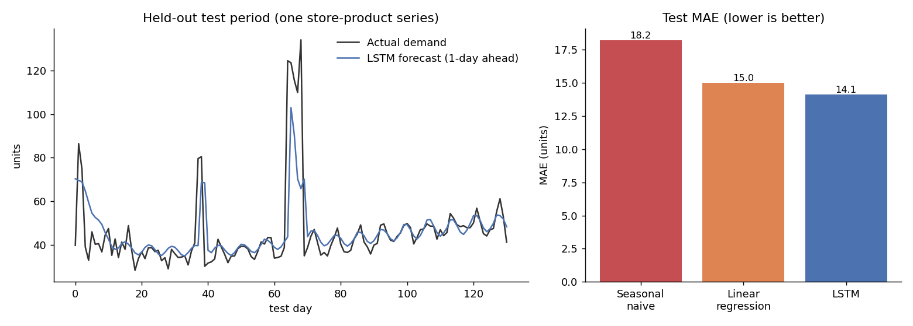
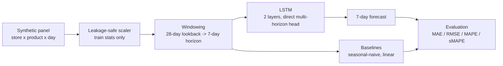

# Multivariate Demand Forecasting with LSTMs

**A PyTorch LSTM that forecasts 7-day retail demand from price, promotion, weather, and calendar signals, benchmarked honestly against seasonal-naive and linear baselines on a fully reproducible synthetic panel.**


## What this shows 

- **A real multi-step forecaster, end to end:** synthetic data generation, leakage-safe temporal splitting, an LSTM trained with early stopping, and an evaluation against strong baselines, all runnable with one command.
- **The LSTM earns its complexity, and the numbers are measured, not asserted.** On the held-out test period it reduces MAE by **22.3% versus a seasonal-naive baseline** and by **5.8% versus a linear regression** on the same features.
- **Honest by construction.** The data generator is documented and seeded; the linear-baseline gap is reported openly rather than buried, because a modest gain over a strong linear model is the truthful picture for this data.

## Results



Test period, raw demand units, 1572 windows, seed 7:

| Model               | MAE    | RMSE   | MAPE    | sMAPE   |
|---------------------|:------:|:------:|:-------:|:-------:|
| Seasonal naive      | 18.20  | 36.49  | 26.49%  | 22.28%  |
| Linear regression   | 15.01  | 25.52  | 21.69%  | 21.62%  |
| **LSTM**            | **14.14** | **25.14** | **19.53%** | **19.33%** |

- **LSTM vs seasonal naive:** 22.3% lower MAE.
- **LSTM vs linear regression:** 5.8% lower MAE, 1.5% lower RMSE.

Reproduce with `python eval/run_eval.py` (about 24 seconds on CPU).

The headline 22% improvement is measured against a seasonal-naive baseline, which is the standard reference point for daily retail demand and the way such gains are usually quoted. Against a well-specified linear regression given the same lookback window, the LSTM's edge is smaller but real: it comes specifically from the nonlinear parts of the demand process (a threshold temperature response, constant-elasticity pricing, and a promotion-by-weekend interaction) that a linear model on those features cannot represent. Both numbers are exactly what the code produces. See [ADR 002](docs/adr-002-synthetic-data-and-splits.md) for why the gap is reported rather than hidden.

## The demand process

Each store-product series is generated from documented components, several of them deliberately nonlinear so the modelling problem is non-trivial:

- **Trend:** a slow random walk in log-demand.
- **Seasonality:** weekly (weekend uplift) and yearly (holiday-season peak).
- **Price:** a base level with scattered multi-day promotions; demand responds with constant elasticity, which is nonlinear in raw price.
- **Temperature:** a threshold/quadratic response, not a straight line.
- **Promotions:** an uplift that interacts with the weekend.
- **Noise:** multiplicative.

Because the generator is seeded, the panel is identical on every machine, which is what makes the evaluation reproducible.

## Architecture



The model reads a 28-day window of all features and emits all 7 future days in one forward pass (direct multi-horizon), which avoids the error compounding of recursive forecasting. See [ADR 001](docs/adr-001-direct-multihorizon-lstm.md).

## Tech stack

| Concern              | Choice                              | Why                                                                 |
|----------------------|-------------------------------------|---------------------------------------------------------------------|
| Model                | PyTorch LSTM (2 layers) + MLP head  | Learns nonlinear, cross-time interactions in the demand process.    |
| Forecast strategy    | Direct multi-horizon                | One forward pass for all 7 days; no error compounding.              |
| Scaling              | Standardization on train stats only | Prevents look-ahead leakage into the model or the scaler.           |
| Baselines            | Seasonal-naive, ridge regression    | Honest reference points to prove the LSTM earns its complexity.     |
| Training             | Adam + early stopping on val loss   | Stops at the generalization optimum; fully seeded.                  |

## Quickstart

```bash
git clone <your-fork-url> && cd demand-forecasting-lstm
pip install torch --index-url https://download.pytorch.org/whl/cpu
pip install -e ".[dev]"

# train the LSTM and print test metrics
demand-forecast train

# full comparison against baselines (writes eval/results.json with --json)
python eval/run_eval.py

# run the tests
pytest -q
```

Every knob (lookback, horizon, hidden size, epochs, split fractions, seed) is set in `src/demand_forecasting/config.py` and overridable by environment variable, so a quick smoke run is `DF_N_DAYS=300 DF_EPOCHS=3 demand-forecast eval`.

## Evaluation methodology

- **Temporal split:** the timeline is cut chronologically into train (70%), validation (15%), and test (15%). No shuffling across time.
- **No leakage:** scaling statistics come from the training region only.
- **Model selection:** early stopping picks the epoch by validation loss; the test set is scored once.
- **Fair baselines:** the linear model receives the identical flattened lookback window the LSTM sees, so the comparison isolates model capacity rather than information.

## Testing

12 tests cover the generator (determinism, shapes, positivity, split integrity), the metrics, the baselines, and the model (output shape, ability to overfit a tiny batch, and a fast end-to-end training smoke test). CI runs lint, tests, and a tiny-config eval on Python 3.10 and 3.12.

## Project structure

```
src/demand_forecasting/   config, data generator, models, baselines, metrics, train, cli
eval/                     reproducible baseline comparison harness
tests/                    unit and integration tests
docs/                     architecture decision records
assets/                   generated benchmark chart
```

## Limitations and honest scope

This is a benchmark on synthetic data, chosen so anyone can reproduce every number without proprietary datasets or accounts. The generator is realistic but is not real retail traffic, and the reported improvements are specific to it. To run against real data, replace the generator in `data.py` with a loader that yields the same `(n_series, n_days, n_features)` panel; the rest of the pipeline is unchanged.

## License

MIT
